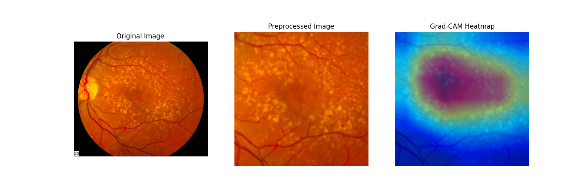

# Retinal Image Classification and Synthetic Data Generation 

Welcome to our repository dedicated to advancing the field of ophthalmology through deep learning. We've compiled three comprehensive Jupyter notebooks, each focusing on a different aspect of retinal image analysis and synthetic data generation.

<div align="center">
  
</div>


## Overview of Features

1. **AMD Classification using ResNet-18**: 
    - **Notebook**: `resnet.ipynb`
    - **Details**: Utilizes the ResNet-18 architecture, pretrained by Oliveira et al. This model is unique in its training approach, combining both real and synthetic data created by StyleGAN-2. This  method enhances the model's ability to generalize, providing more accurate classifications in the detection of Age-related Macular Degeneration (AMD).

2. **Retinal Image Quality Assessment**:
    - **Notebook**: `eyeq.ipynb`
    - **Details**: Employs a DenseNet architecture trained by [Fu et al.](https://arxiv.org/abs/1907.05345) This model classifies retinal images into three categories: "Good," "Usable," and "Reject." Images categorized as "Reject" typically exhibit issues such as significant blurring, low contrast, or inadequate illumination, indicating poor quality.

3. **Synthetic Fundus Eye Generation with StyleGAN-2**:
    - **Notebook**: `synthetic.ipynb`
    - **Details**: Utilizes StyleGAN-2, pretrained by Oliveira et al., to generate synthetic images of the retina fundus. These images depict various stages of age-related macular disease, contributing to the dataset's diversity and aiding in the training of more robust AMD classification models.

## Getting Started

These instructions will get you a copy of the project up and running on your local machine for development and testing purposes.

### Prerequisites

Before you begin, ensure you have the following installed:

- [Anaconda](https://www.anaconda.com/distribution/) or [Miniconda](https://docs.conda.io/en/latest/miniconda.html)
- [Git](https://git-scm.com/)

### Installation

1. **Clone the Repository**

   ```bash
   git clone https://github.com/GuiCamargoX/synthetic-retina-amd.git
   cd synthetic-retina-amd

2. **Downloading Model Weights:**

    Before running the application, download the required model weights for DenseNet, ResNet18, StyleGAN2:

    * [DenseNet Weights](https://drive.google.com/file/d/1KwR0JkdyzidSqYXs2PHpKms6tmBjxuB6/view?usp=sharing)

    * [ResNet18 Weights](https://drive.google.com/file/d/1W2X9EazWNW___ctrfAZ3z9OdMNx40iUw/view?usp=sharing)

    * [StyleGAN2 Weights](https://drive.google.com/file/d/1apgXspWvzfk0NKLsDgnR5K0fGB9MSvB6/view?usp=sharing)

    Place these weights in the specified directory (e.g., **weights/**).

3. **Create Conda environment:**
   
   ```bash
    conda env create -f environment.yml

4. **Activate the Conda environment and Launch Jupyter Notebook:**

   ```bash
    conda activate retina
    jupyter notebook

## Contributing

We welcome contributions from the community.


## License

This project is licensed under the MIT License.


## Reference

If you use this dataset and code, please cite the following papers:

1.Huazhu Fu, Boyang Wang, Jianbing Shen, Shanshan Cui, Yanwu Xu, Jiang Liu, Ling Shao, "Evaluation of Retinal Image Quality Assessment Networks in Different Color-spaces", in MICCAI, 2019.

## Acknowledgement

We would like to thank Fu et al. for sharing their code at [https://github.com/HzFu/EyeQ](https://github.com/HzFu/EyeQ).
